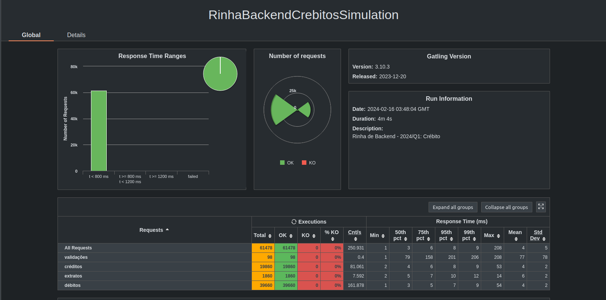

# My Way

Minha versão ruby com sinatrinha para a [rinha do backend 2ª edição](https://github.com/zanfranceschi/rinha-de-backend-2024-q1) 2024/Q1

 

Grande parte consegui fazer graças ao repo do brabo [@leandronsp](https://github.com/leandronsp/agostinho) e das lives na twitch

## Stack

* Ruby 3.3.0
* PostgreSQL
* Nginx

## Instalação de gems

```
$ docker-compose run api1 bundle

ou

$ make instal.ando
```

## Uso em Dev

```
$ docker compose up -d nginx

ou

$ make dev.ando
```

## Uso em Prod

```
$ docker-compose -f docker-compose-prod.yml up -d nginx

ou

$ make produz.indo
```

## Testes de Estresse

```
$ make estress.ando
$ open load-test/user-files/results/**/index.html
```

## Resultados Obtidos




